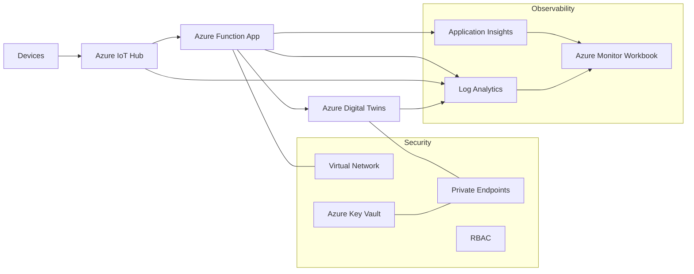

# IoT Platform For Secure Real-Time Operations

This repository demonstrates a production-style Azure IoT platform that transforms device telemetry into operational insight while maintaining strong security and governance.

The platform processes real-time device data, updates a Digital Twins model representing physical assets, and provides observability and controlled access through private networking, RBAC, and infrastructure as code.

## Key Capabilities

- Secure IoT telemetry ingestion
- Event-driven processing with Azure Functions
- Digital Twins integration for asset modeling
- Private networking and RBAC-based service access
- Centralized monitoring and troubleshooting

## Business Problem

Many organizations want real-time visibility into connected assets such as sensors, rooms, equipment, or facility devices. The challenge is not simply receiving telemetry. The challenge is doing it in a way that supports:

- secure access to sensitive operational data
- predictable and repeatable deployments
- controlled service-to-service permissions
- troubleshooting when integrations fail
- a clear path from telemetry to business context

Without that, an IoT solution stays a demo instead of becoming an operational platform.

## Business Value

This platform is designed to support outcomes that matter to stakeholders:

- faster visibility into asset state through real-time telemetry ingestion
- stronger security posture through private endpoints, restricted network access, and RBAC
- lower operational risk through infrastructure as code and standard resource composition
- better troubleshooting through centralized diagnostics, metrics, and logs
- a reusable platform foundation for building, facilities, or industrial monitoring scenarios

## Architecture Overview

The platform follows a straightforward event-driven flow:

```text
Device
  ↓
IoT Hub
  ↓
Azure Function
  ↓
Digital Twins

Monitoring
Azure Monitor + Application Insights + Log Analytics
```

- IoT devices send telemetry to Azure IoT Hub
- Azure Function App consumes incoming events
- The Function maps the device to the correct Digital Twins entity
- Azure Digital Twins is updated with the latest telemetry values
- Azure Monitor, Application Insights, and Log Analytics provide operational visibility

## Architecture Diagram



Core platform components:

- Azure IoT Hub
- Azure Function App Flex Consumption
- Azure Digital Twins
- Azure Storage Account
- Azure Key Vault
- Virtual Network, private DNS, and private endpoints
- Log Analytics, Application Insights, and workbook-based monitoring

## Security And Governance

Security was treated as a design requirement, not an optional enhancement.

- private endpoints are used for core data-plane access
- private DNS supports internal name resolution for private services
- public access is restricted where the platform supports it
- RBAC is used for service-to-service authorization where supported by the service
- managed identity is used for supported Azure integrations
- Terraform provides consistent naming, repeatable deployment, and controlled environment composition

This reflects a practical cloud operating model: secure defaults, explicit permissions, and predictable deployment behavior.

## Operational Observability

The project includes observability as part of the platform design.

- diagnostic settings send resource data into Log Analytics
- Application Insights supports Function telemetry and health investigation
- Azure Monitor Workbook provides an operations view across the solution
- the platform was actively troubleshot end to end, including Function startup, Event Hub trigger behavior, Digital Twins updates, and monitoring configuration

This matters because production systems are judged not only by how they work when healthy, but by how quickly they can be understood and recovered when they fail.

## Example Business Scenario

A facilities team wants to monitor thermostats across a portfolio of buildings. Device telemetry should update the digital representation of real spaces and equipment in near real time. The same organization also needs private connectivity, role-based access, and a supportable operating model for platform troubleshooting.

This project implements that pattern.

## Key Architecture Decisions

- Use Terraform modules to keep the environment readable and repeatable
- Use Azure Digital Twins to add business context to raw device telemetry
- Use private networking for core platform services rather than relying on open public access
- Use Azure Functions as the event-driven processing layer between telemetry ingestion and twin updates
- Include monitoring, diagnostics, and workbook-based visibility as part of the delivered platform
- Use the IoT Hub Event Hub-compatible connection string for the Function trigger, because that is the practical and supported trigger path for this design

## Project Structure

- `adt/`  
  Digital Twins models, seed data, and deployment helper script

- `app/`  
  Azure Function application that processes telemetry and updates twins

- `terraform/`  
  Infrastructure as code for networking, security, platform services, observability, and environment composition

## Technical Flow

1. A device sends telemetry to IoT Hub.
2. IoT Hub exposes the event through its Event Hub-compatible endpoint.
3. The Azure Function trigger consumes the event.
4. The Function extracts the device identity and telemetry payload.
5. The device is mapped to the correct Digital Twins entity.
6. The twin is updated with the latest values.
7. Logs, metrics, and diagnostics support monitoring and troubleshooting.

## What This Repository Demonstrates

This is not just a service collection. It shows the ability to:

- translate a business monitoring need into a secure cloud platform
- design for both delivery and operations
- handle integration tradeoffs between security, networking, and platform support limits
- build and troubleshoot a production-style event-driven architecture on Azure
